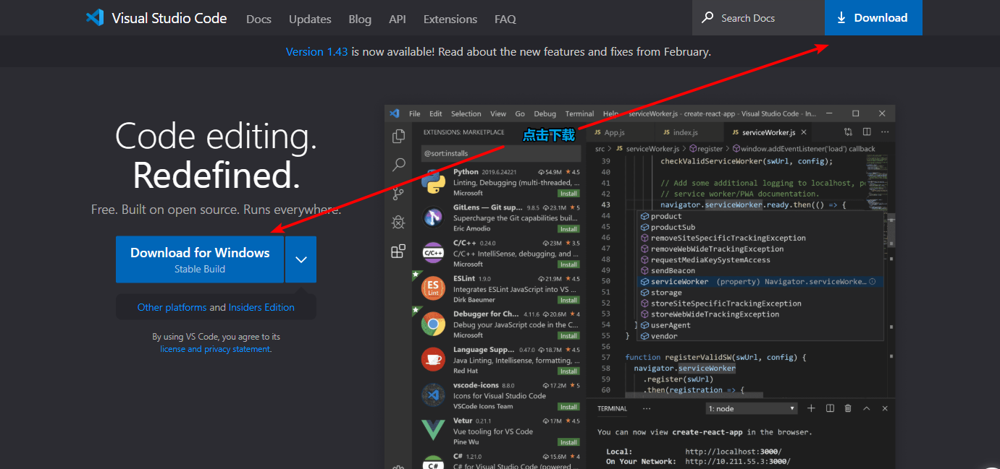
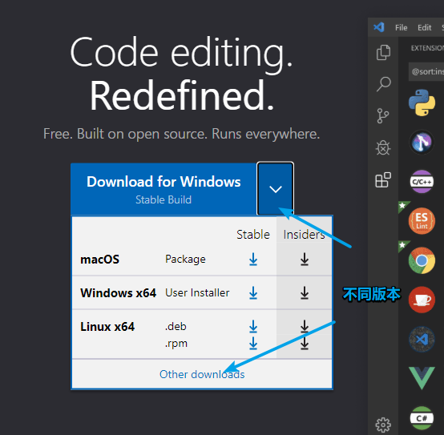
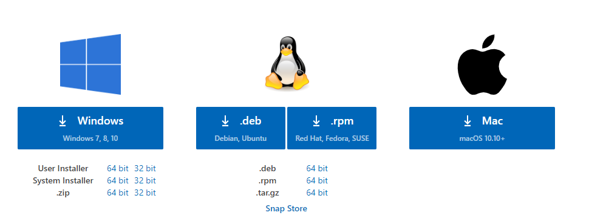

# 前言

​		我是一个学习编程的学生，目前面临着毕业， 因为疫情，所有想做点什么，一是消磨时间，二来也能提高一下自己。这算是一个对知识的梳理，也是自己的一次练习。

​		这是我第一次做关于VScode的介绍内容，我将从软件安装配置等方面向大家介绍这个东西。VScode，也是我最近才开始接触的一款新的编译器。是一款开源的，多平台的源代码编译器。

​		我想学一些新的东西的时候，一般都会自己动手试一试。出现问题的时候，再去哔哩哔哩上搜索相应的教程。这样就能很快的入门一些新的东西。

​		声明一点就是，我只是个学生，这些也只是我在学习中的笔记记录，整理出来的。内容仅代表个人认知水平。

# 第一章  VScode简单介绍

## visual studio code

Microsoft在2015年4月30日Build 开发者大会上正式宣布了 Visual Studio Code 项目：一个运行于 Mac OS X、[Windows](https://baike.baidu.com/item/Windows)和 Linux 之上的，针对于编写现代 Web 和云应用的跨平台源代码编辑器。

- 软件名称

  Visual Studio Code

- 开发商

  美国微软公司（Microsoft Corporation）

- 软件平台

  Windows、Linux、macOS（Mac OS X）

- 软件版本

  1.42

- 更新时间

  2020-02-07

- 软件语言

  英文

- 软件授权

  微软预发布软件许可证

- 开发框架

  基于Chromium开发的

## 产生背景

  这标志着微软公司第一次向开发者们提供了一款真正的跨平台编辑器。虽然完整版的 Visual Studio 仍然是只能运行在 Windows 和 macOS（Mac OS X ）之上，但是这一次的声明向我们展示了微软公司对于支持其他计算机平台的承诺。 

## 发展历程

  “很多人都使用Windows作为他们的开发环境，但是我们也注意到了，还有很多人使用 Linux 和 Mac“，Somasegar，微软公司的开发者事业部总裁在这周稍早时候对笔者如是说道。”我们想让他们能够在他们习惯的平台上使用我们公司的产品，而不是非要迁徙到 Windows 上“。这些平台上的很多开发者们也更乐意于使用像 Sublime Text 这种轻量级的代码编辑器，而非像 Visual Studio 这种全特性的 IDE。

## 主要功能

  该编辑器也集成了所有一款现代编辑器所应该具备的特性，包括语法高亮（syntax high lighting），可定制的热键绑定（customizable keyboard bindings），括号匹配（bracket matching）以及代码片段收集（snippets）。Somasegar 也告诉笔者这款编辑器也拥有对 Git 的开箱即用的支持。

  Visual Studio Code 提供了丰富的快捷键 。用户可通过快捷键 [Ctrl] + [K] + [S] （按住Ctrl键不放，再按字母K键和S键）调出快捷键面板，查看全部的快捷键定义。也可在面板中双击任一快捷键，为某项功能指定新的快捷键。一些预定义的常用快捷键包括：格式化文档（整理当前视图中的全部代码），[Shift] + [Alt] + [F]；格式化选定内容（整理当前视图中被选定部分代码），[Ctrl] + [K] + [F]；放大视图，[Ctrl] + [Shift] + [=]；缩小视图，[Ctrl] + [Shift] + [-]；打开新的外部终端（打开新的命令行提示符）：[Ctrl] + [Shift] + [C]。

## 语言支持

  该编辑器支持多种语言和文件格式的编写，截止2019年9月，已经支持了如下37种语言或文件：F#、HandleBars、Markdown、Python、Java、PHP、Haxe、Ruby、Sass、Rust、PowerShell、Groovy、R、Makefile、HTML、JSON、TypeScript、Batch、Visual Basic、Swift、Less、SQL、XML、Lua、Go、C++、Ini、Razor、Clojure、C#、Objective-C、CSS、JavaScript、Perl、Coffee Script、Dockerfile。

# 第二章 软件安装

## 1.vscode的下载

我们可以从[vscode官网](https://code.visualstudio.com/)上下载软件的安装包，这个网站的下载速度还是比较快的。浏览器是自动匹配操作系统的。用于本电脑一般就可以直接点击这两处**`Download`**进行下载。

如果想应用到别的系统中可以点击尖角，查看不同的版本。进行下载。

针对不同的操作系统，都有不同的选择。

## 2.软件安装（windows系统）

